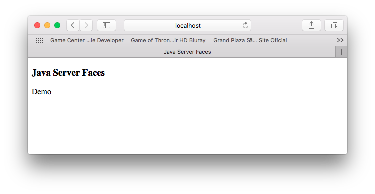

# Java EE con JSF

Aplicación Java Web usando JSF (Java Server Faces).


## Prerequisitos

1. Maven 3+
2. Java 8+

## Como correr

1. Clon

	```
	git clone https://github.com/humbertodias/java-jsf-demo.git
	```

2. Entrar en la carpeta

	```
	cd java-jsf-demo
	```

3. Correr 

	```
	mvn jetty:run -Djetty.http.port=9999
	```	
	```
	INFO: JSF1048: PostConstruct/PreDestroy annotations present.  ManagedBeans methods marked with these annotations will have said annotations processed.
[INFO] Started o.e.j.m.p.JettyWebAppContext@1d207fad{/,[file:///Users/humbertodias/git/java-jsf-demo/src/main/webapp/, jar:file:///Users/humbertodias/.m2/repository/com/sun/faces/jsf-impl/2.2.14/jsf-impl-2.2.14.jar!/META-INF/resources],AVAILABLE}{file:///Users/humbertodias/git/java-jsf-demo/src/main/webapp/}
[INFO] Started ServerConnector@4c5abfca{HTTP/1.1,[http/1.1]}{0.0.0.0:9999}
[INFO] Started @6330ms
[INFO] Started Jetty Server
[INFO] Using Non-Native Java sun.nio.fs.PollingWatchService
[WARNING] Quiet Time is too low for non-native WatchService [sun.nio.fs.PollingWatchService]: 1000 < 5000 ms (defaulting to 5000 ms)
	```
	
4. Por último, en su navegador

	[http://localhost:9999](http://localhost:9999)

# Respuesta




## Referencias

[JSF Home](http://www.oracle.com/technetwork/java/javaee/javaserverfaces-139869.html)